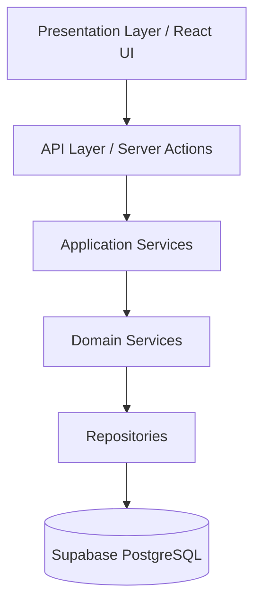
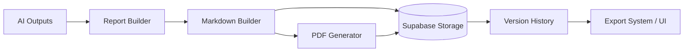

# Marketing Workspace: Software Architecture & Implementation Specification

## 1. Project Overview & Core Philosophy

Marketing Workspace is an AI-powered Product Marketing Operating System designed to autonomously generate comprehensive marketing strategies, reports, and content for individual products. 

### Fixed Design Principles
- **Product First**: Everything revolves around a `Product`. A Product is an immutable, long-lived marketing project. It cannot be edited or deleted once generated.
- **No Organizations/Teams**: Products belong directly to individual Users. There are no shared workspaces, teams, or organization layers.
- **Asynchronous AI Orchestration**: Users never communicate directly with AI. There is no chatbot. AI operates strictly behind the scenes via structured, asynchronous workflows.
- **Subscription Integrity**: The Free tier limits the *number* of Products. The Pro tier allows up to 10 Products per billing cycle. Because Products are immutable and archived (not deleted), subscription limits are strictly enforced.

---

## 2. System Architecture

### 2.1. Monorepo Structure & Shared Packages
The project utilizes Turborepo to enforce strict module boundaries and separation of concerns.

**Applications (`apps/`)**
- `marketing`: Public-facing website (Next.js App Router).
- `app`: Customer SaaS dashboard for managing Product Workspaces (Next.js App Router).
- `admin`: Internal administration and system monitoring platform (Next.js App Router).

**Shared Packages (`packages/`)**
- `api`: Internal API client wrappers and tRPC/REST routers.
- `auth`: Supabase authentication utilities, session management, and role-based access.
- `database`: Supabase PostgreSQL client, schema definitions, and migrations.
- `storage`: Supabase Storage utilities (image uploads, report storage).
- `ai`: AI Orchestrator, Provider Registry, and Prompts.
- `workflows`: Dependency-aware job execution engine and state management.
- `billing`: Stripe/subscription logic and usage quota tracking.
- `reports`: Markdown/PDF builders and report generators.
- `email`: Transactional email templates and delivery services.
- `notifications`: In-app notification dispatcher.
- `analytics`: User behavioral tracking and telemetry.
- `monitoring`: System health, Sentry error tracking, and performance metrics.
- `validation`: Zod schemas for strict request/response validation.
- `hooks`: Shared React hooks (`useUser`, `useProduct`, etc.).
- `utils`: Generic helper functions (formatting, date logic).
- `config`: Shared ESLint, Prettier, TypeScript, and Tailwind configurations.
- `ui`: Shared React components built on shadcn/ui.
- `design-system`: Extracted Figma design tokens, colors, and typography rules.
- `types`: Global TypeScript interfaces and domain models.

### 2.2. Backend Architecture
The application strictly follows a layered architecture to decouple business logic from the presentation layer. Business logic must **never** exist inside React components.

- **Presentation Layer**: Client/Server React Components handling state and UI rendering.
- **API Layer**: Next.js Server Actions and Route Handlers. Strictly handles request validation (via `packages/validation`) and authorization.
- **Application Services**: Orchestrates business use cases (e.g., `CreateProductService`). Dispatches events and calls multiple Domain Services.
- **Domain Services**: Encapsulates core business logic (e.g., calculating subscription quotas, determining job dependencies).
- **Repositories**: The exclusive layer for database access. No other layer communicates directly with the Supabase client.

### 2.3. Event-Driven Architecture
To decouple modules, the system relies on an internal Event Bus. Modules react to domain events rather than calling each other directly.

**Core Events:**
- `ProductCreated`: Triggers billing quota updates and initiates `WorkflowCreated`.
- `WorkflowCreated`: Triggers the initialization of the Workflow Engine.
- `WorkflowStarted`: Updates UI status and locks the Product.
- `JobStarted`: Signals the start of a specific AI task.
- `JobCompleted`: Resolves a dependency graph node, potentially triggering downstream jobs.
- `WorkflowCompleted`: Triggers the compilation of the Marketing Summary and sends a `Notification/Email`.
- `ReportGenerated`: Saves the report reference to the database and notifies the user.
- `SubscriptionUpdated`: Recalculates limits and adjusts user capabilities.

### 2.4. Caching Strategy
To optimize performance and reduce AI provider costs, deterministic and slow-changing data is heavily cached. User-specific mutable data (like profiles or active job statuses) is **never** cached.

**Cached Entities:**
- **Provider Responses**: Raw AI provider outputs for idempotent requests (keyed by hash of the prompt + inputs).
- **SEO & Market Research**: Broad search results for specific niches/keywords (cached for 24-48 hours).
- **Competitor Research**: Public scraped data for competitor URLs (cached for 7 days).
- **Generated Reports**: Final compiled Markdown/PDFs are stored immutably in Supabase Storage and served via CDN.

---

## 3. AI Infrastructure

The AI Infrastructure is the core engine of the platform, designed to be provider-agnostic, resilient, and highly observable.

### 3.1. AI Orchestrator & Workflow Engine
The AI execution relies on several decoupled sub-systems:
- **Provider Registry**: Abstracts external APIs (NVIDIA NIM, OpenAI, Serper). Allows hot-swapping models without changing business logic.
- **Workflow Engine**: Manages the overarching `Workflow` entity tied to a `Product`.
- **Dependency Graph (DAG)**: Computes the execution order. E.g., `CompetitorAnalysis` cannot run until `MarketResearch` completes.
- **Job Scheduler**: Evaluates the DAG and pushes available jobs to the Queue.
- **Queue Abstraction**: Handles asynchronous job processing (e.g., via Inngest or Supabase Queues).
- **Retry System & Failure Recovery**: Implements exponential backoff for rate limits or network failures. Marks jobs as `failed` after maximum retries, pausing the workflow.
- **Rate Limiting**: Strictly controls outbound requests to AI providers to prevent 429 errors.
- **AI Monitoring, Logging & Metrics**: Captures latency, success rates, and errors per provider.

### 3.2. Prompt Architecture
Prompts are treated as first-class code assets. They are strictly versioned and **never** hardcoded inline within services. 

Structure in `packages/ai/prompts/`:
- `marketResearch.ts`
- `competitorAnalysis.ts`
- `personas.ts`
- `positioning.ts`
- `seo.ts`
- `marketingStrategy.ts`
- `landingPage.ts`
- `socialMedia.ts`
- `emailCampaign.ts`

Each prompt file exposes a typed template function that accepts validated input arguments and returns the exact string to be sent to the Provider Registry. This ensures prompts can be unit-tested independently.

### 3.3. AI Cost Tracking
Every AI interaction records telemetry to track profitability and detect anomalies.

Stored per `Job` and aggregated per `Workflow`:
- **Provider & Model Name** (e.g., `nvidia/llama-3.1`)
- **Prompt Tokens**
- **Completion Tokens**
- **Latency** (ms)
- **Estimated Cost** ($)
- **Workflow Total Cost**

---

## 4. Module Architectures

### 4.1. Reports Architecture
The Reports system translates raw AI outputs into polished, exportable assets.

- **Report Builder**: Aggregates various AI job results into a cohesive structure.
- **Markdown Builder**: Formats the report with branding and typography.
- **PDF Generator**: Converts the Markdown to a downloadable PDF via Headless Chrome / Playwright.
- **Version History**: Appends new reports immutably.

---

## 5. Development Roadmap

*Note: This structure defines the requirements for each phase. Detailed granular tasks will be expanded dynamically as we enter each phase.*

### Phase 1.1: Repository & Monorepo Setup
- **Objectives**: Establish the Turborepo foundation.
- **Deliverables**: Empty `apps/` and `packages/` structure.
- **Backend/Frontend Tasks**: Initialize Next.js configs.
- **Definition of Done**: `pnpm build` succeeds globally.

### Phase 1.2: Development Tooling
- **Objectives**: Ensure code quality and consistency.
- **Deliverables**: ESLint, Prettier, TypeScript configs.
- **Backend/Frontend Tasks**: Setup `packages/config`.
- **Definition of Done**: `pnpm lint` and typechecking pass.

### Phase 1.3: Shared Packages
- **Objectives**: Scaffold internal library boundaries.
- **Deliverables**: Base structures for all `packages/*`.
- **Definition of Done**: Apps can import empty modules from packages.

### Phase 1.4: Design System
- **Objectives**: Translate Figma designs into code tokens.
- **Deliverables**: `packages/design-system` containing colors, fonts, spacing.
- **Definition of Done**: Tokens are mapped to Tailwind variables.

### Phase 1.5: UI Foundation
- **Objectives**: Setup reusable UI components.
- **Deliverables**: `packages/ui` configured with shadcn/ui.
- **Frontend Tasks**: Implement base buttons, inputs, modals matching Figma.
- **Definition of Done**: UI components render correctly in a test page.

### Phase 2: Database & Security (Detailed Implementation Plan)

**Goal**: Establish a secure data layer with Supabase, define immutable Product schemas, enforce Row-Level Security (RLS), and set up a centralized `.env` configuration.

## User Review Required
> [!IMPORTANT]
> - We will create a centralized `.env` and `.env.example` at the root of the Turborepo as requested. All apps and packages will read from this single source of truth.
> - We will initialize Supabase CLI to manage the database schema via migrations.
> - We will define the `products` table as immutable (Updates and Deletes will be restricted via RLS).

## Proposed Changes

### 1. Centralized Environment Variables
- **[NEW] [A:\projects\marketing-workspace\.env](file:///A:/projects/marketing-workspace/.env)**: Centralized environment variables for Supabase keys, Next.js URLs, etc.
- **[NEW] [A:\projects\marketing-workspace\.env.example](file:///A:/projects/marketing-workspace/.env.example)**: Example configuration template.

### 2. Supabase Infrastructure (`packages/database`)
- **[NEW] `supabase/config.toml`**: We will initialize Supabase at the root or within `packages/database`. Given the monorepo, initializing at the root but storing migrations in `packages/database/supabase/migrations` is optimal.
- **[NEW] `packages/database/supabase/migrations/00000000000000_init_schema.sql`**:
  - Enable required extensions (`uuid-ossp`).
  - Create `products` table (id, user_id, status, basic info, ai_generated_content).
  - Create `workflows` and `jobs` tables for the AI orchestrator.

### 3. Row-Level Security (RLS)
- **[NEW] `packages/database/supabase/migrations/00000000000001_rls_policies.sql`**:
  - `products` SELECT: `TO authenticated USING ((select auth.uid()) = user_id)`
  - `products` INSERT: `TO authenticated WITH CHECK ((select auth.uid()) = user_id)`
  - `products` UPDATE/DELETE: Disabled entirely for end-users to enforce the **Immutable Product** rule. Only system-level `service_role` can update the AI generated columns during workflows.

### 4. Database Access Layer
- **[NEW] `packages/database/src/client.ts`**: Supabase server-side client utilizing `@supabase/ssr`.
- **[NEW] `packages/database/src/repositories/product.repository.ts`**: Encapsulated data access methods (e.g., `createProduct`, `getProductsByUserId`).

## Verification Plan
### Automated Tests
- Run `supabase db start` to verify the local Docker container boots correctly.
- Run `pnpm run check-types` in `packages/database` to ensure TypeScript compilation of the database client.
- Seed script to verify RLS correctly blocks an `anon` user from reading the `products` table.

### Phase 3: Authentication (Detailed Implementation Plan)

**Goal**: Establish secure user onboarding, session management, email verification, and password recovery using Supabase Auth across the monorepo. Protect the customer dashboard (`apps/app`) routes.

## User Review Required
> [!IMPORTANT]
> - We will create a shared `packages/auth` library to handle `@supabase/ssr` logic (Middleware, Server Client, Browser Client). This ensures all 3 Next.js apps share identical, secure session retrieval logic.
> - The Customer Dashboard (`apps/app`) will be strictly protected by Next.js Middleware. Unauthenticated users will be redirected to the login page.
> - We will implement the complete Auth UI using `shadcn/ui` components: Login, Registration, Forgot Password, and Reset Password.
> - Email verification and password reset links will route through an `/auth/callback` API endpoint to securely set session cookies before redirecting to the app or password update form.

## Proposed Changes

### 1. Auth Package (`packages/auth`)
- **[NEW] `packages/auth/package.json`**: Scaffold the package with `@supabase/ssr` and `@supabase/supabase-js`.
- **[NEW] `packages/auth/src/server.ts`**: Helper to create a Next.js server-side Supabase client with cookie management.
- **[NEW] `packages/auth/src/client.ts`**: Helper to create a browser-side Supabase client.
- **[NEW] `packages/auth/src/middleware.ts`**: Shared middleware logic to update Supabase sessions and enforce route protection.

### 2. Route Protection (`apps/app`)
- **[NEW] `apps/app/middleware.ts`**: Implement the `packages/auth` middleware to protect all routes under `/` (except auth routes like `/login`, `/register`, etc.).

### 3. Authentication UI (`apps/app`)
- **[NEW] `apps/app/app/(auth)/login/page.tsx`**: Login page with Email/Password form.
- **[NEW] `apps/app/app/(auth)/register/page.tsx`**: Registration page with Email/Password form.
- **[NEW] `apps/app/app/(auth)/forgot-password/page.tsx`**: Page to request a password reset email.
- **[NEW] `apps/app/app/(auth)/reset-password/page.tsx`**: Page to enter a new password (accessed via the email link).
- **[NEW] `apps/app/app/auth/callback/route.ts`**: API route to handle all Supabase magic links: OAuth callbacks, **Email Verification** links, and **Password Reset** flows.

## Verification Plan
### Automated & Manual Tests
- Verify navigation to `http://localhost:3001/` redirects to `/login`.
- Submit the Registration form and verify the confirmation email is queued/sent.
- Click an email verification link and ensure it establishes a session and redirects correctly.
- Submit a "Forgot Password" request, click the reset link, and verify the password can be successfully updated.

### Phase 4: Storage & Billing
- **Objectives**: Asset storage and quota enforcement.
- **Deliverables**: Supabase buckets, Subscription domain services.
- **Backend Tasks**: Stripe webhook integration, quota checks.
- **Definition of Done**: Free users cannot exceed 1 product creation.

### Phase 5: Customer Dashboard Shell
- **Objectives**: Implement the core SaaS UI layout.
- **Deliverables**: Sidebar, Header, Navigation.
- **Frontend Tasks**: Build layout matching Figma.
- **Definition of Done**: Responsive dashboard shell is fully navigable.

### Phase 6: Products Module
- **Objectives**: Display user products.
- **Deliverables**: Products List view, status badges.
- **Frontend Tasks**: Grid/List UI, Usage counter.
- **Backend Tasks**: Product query endpoints.
- **Definition of Done**: User can view their (currently empty) product list.

### Phase 7: Multi-step Wizard
- **Objectives**: Product onboarding experience.
- **Deliverables**: 8-step form with validation.
- **Frontend Tasks**: Form state management, Image uploads.
- **Backend Tasks**: `CreateProductService` execution (saves product as `draft`).
- **Validation Tasks**: Zod schema enforcement.
- **Definition of Done**: Submitting the wizard successfully creates an immutable Product record in `draft` status and redirects to the Product Workspace.

### Phase 8: Product Details & Pre-Generation Workspace
- **Objectives**: Display the collected product details before generating the AI strategy.
- **Deliverables**: Product Workspace UI (`/products/[id]`).
- **Frontend Tasks**: 
  - Render all entered product details structurally.
  - Implement "Generate marketing strategy" button (changes status from `draft` to `processing`).
  - Quick Actions dropdown (Edit, Export Report).
  - Workflow Modules sidebar (shows checklist of AI workflow steps).
- **Backend Tasks**: Action to transition product to `processing` and initialize the workflow engine.
- **Definition of Done**: User can view their saved details and manually trigger the AI strategy generation.

### Phase 9: AI Infrastructure
- **Objectives**: Build the workflow and execution engine.
- **Deliverables**: DAG scheduler, Queue abstraction, Cost tracking.
- **Backend Tasks**: Implement Workflow Engine and Provider Registry.
- **Testing Tasks**: Mock provider tests, DAG resolution tests.
- **Definition of Done**: A mock workflow successfully resolves all dependencies and updates the Workspace modules UI in real-time.

### Phase 10: AI Marketing Modules
- **Objectives**: Implement actual marketing intelligence.
- **Deliverables**: Prompt registry and specific job handlers.
- **Backend Tasks**: Write and tune prompts for Personas, SEO, etc.
- **Definition of Done**: Real AI calls return structured marketing JSON.

### Phase 11: Marketing Summary
- **Objectives**: Display the generated marketing workspace.
- **Deliverables**: Product homepage UI.
- **Frontend Tasks**: Render complex AI outputs into beautiful UI cards.
- **Definition of Done**: Completed workflow displays all data perfectly.

### Phase 11: Reports
- **Objectives**: Exportable marketing assets.
- **Deliverables**: Report Builder, PDF Generator.
- **Backend Tasks**: Markdown to PDF pipeline.
- **Definition of Done**: User can download a generated PDF report.

### Phase 12: Marketing Website
- **Objectives**: Public landing pages.
- **Deliverables**: SEO-optimized static pages.
- **Frontend Tasks**: Pricing, Features, FAQ.
- **Definition of Done**: High Lighthouse scores on public routes.

### Phase 13: Admin Platform
- **Objectives**: Internal management.
- **Deliverables**: `apps/admin` dashboard.
- **Security Tasks**: Super Admin vs Admin RBAC.
- **Definition of Done**: Admins can view system metrics and user lists.

### Phase 14: Monitoring
- **Objectives**: System observability.
- **Deliverables**: Sentry, Analytics, AI Logging.
- **Backend Tasks**: Event listener telemetry.
- **Definition of Done**: Errors in production trigger alerts.

### Phase 15: Testing
- **Objectives**: Ensure platform stability.
- **Deliverables**: Playwright E2E suite.
- **Testing Tasks**: Write critical path tests.
- **Definition of Done**: CI pipeline passes all tests.

### Phase 16: Production Deployment
- **Objectives**: Go live.
- **Deliverables**: Vercel production environments.
- **Security Tasks**: Secrets management, SSL validation.
- **Definition of Done**: Application is live on production domains.
